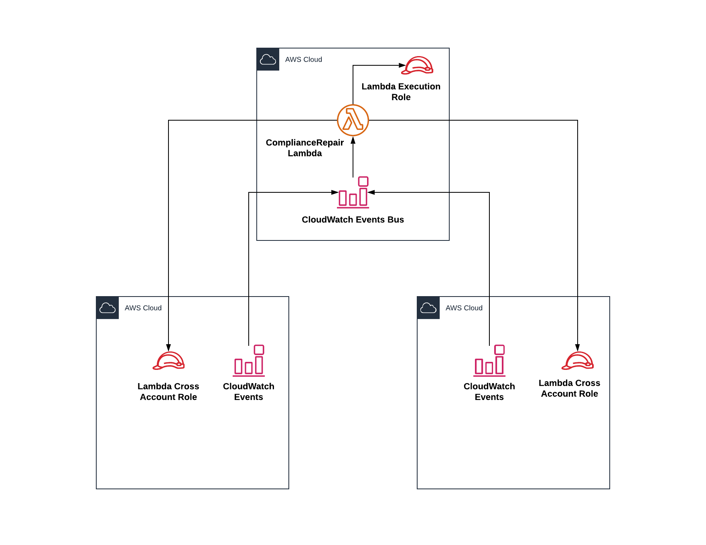

## AWS Compliance Repair
---
This demo PoC shows how to use automatic remediation of compliance issues at scale across accounts in your AWS organization by using CloudWatch events for quick actions.

### Supported issues:
* Violations of specified requirements for IAM users password policy
* Disabling of CloudTrail logging
* Disabling of AWS Config recorder
* Disabling of S3 bucket public access block
* Addition of all new buckets to Macie

## Design
---


## Prerequisites
---
This assumes you already have Macie setup with your [spoke accounts added](https://docs.aws.amazon.com/macie/latest/userguide/macie-integration.html) and required [service-linked role](https://docs.aws.amazon.com/macie/latest/userguide/using-service-linked-roles.html#create-slr).


## Options
---
* Terraform main variables.tf files
```
aws_profile
aws_region
org_id
```
* Terraform spoke variables.tf
```
aws_profile
aws_region
org_id
event_bus_arn
cross_account_role_arn
```
* [Account wide password policy](https://github.com/kbcaleb/compliance-repair/blob/master/main/lambda_function.py#L86-L98)
```
# Default policy
MinimumPasswordLength=14,
RequireSymbols=True,
RequireNumbers=True,
RequireUppercaseCharacters=True,
RequireLowercaseCharacters=True,
AllowUsersToChangePassword=True,
MaxPasswordAge=90,
PasswordReusePrevention=24,
HardExpiry=False
```

## Deployment
---
* Depoly the terraform main template into your central security account. This account should also be the same as your macie master account.
  * Template includes
    * CloudWatch Orgnization Events Bus
    * ComplianceRepair Lambda Role
    * ComplianceRepair Lambda Function
    * CloudWatch events for
      * [iam:UpdateAccountPasswordPolicy](https://docs.aws.amazon.com/IAM/latest/APIReference/API_UpdateAccountPasswordPolicy.html)
      * [cloudtrail:StopLogging](https://docs.aws.amazon.com/awscloudtrail/latest/APIReference/API_StopLogging.html)
      * [s3:DeleteBucketPublicAccessBlock](https://docs.amazonaws.cn/en_us/AmazonS3/latest/API/API_DeletePublicAccessBlock.html), [s3:PutBucketPublicAccessBlock](https://docs.amazonaws.cn/en_us/AmazonS3/latest/API/API_PutPublicAccessBlock.html), [s3:CreateBucket](https://docs.amazonaws.cn/en_us/AmazonS3/latest/API/API_CreateBucket.html)
      * [config:StopConfigurationRecorder](https://docs.aws.amazon.com/config/latest/APIReference/API_StopConfigurationRecorder.html)

* Deploy the terraform spoke template into your spoke accounts.
  * Template includes
    * CloudWatch Events Bus Role
    * ComplianceRepair Cross Account Role
    * CloudWatch events for
      * [iam:UpdateAccountPasswordPolicy](https://docs.aws.amazon.com/IAM/latest/APIReference/API_UpdateAccountPasswordPolicy.html)
      * [cloudtrail:StopLogging](https://docs.aws.amazon.com/awscloudtrail/latest/APIReference/API_StopLogging.html)
      * [s3:DeleteBucketPublicAccessBlock](https://docs.amazonaws.cn/en_us/AmazonS3/latest/API/API_DeletePublicAccessBlock.html), [s3:PutBucketPublicAccessBlock](https://docs.amazonaws.cn/en_us/AmazonS3/latest/API/API_PutPublicAccessBlock.html), [s3:CreateBucket](https://docs.amazonaws.cn/en_us/AmazonS3/latest/API/API_CreateBucket.html)
      * [config:StopConfigurationRecorder](https://docs.aws.amazon.com/config/latest/APIReference/API_StopConfigurationRecorder.html)

## License
---
This library is licensed under the Apache 2.0 License.